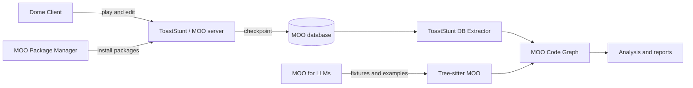

# LambdaMOO Programming Resources

An organized collection of MOO programming manuals, tutorials, historical source
documents, reusable code, and modern developer tooling.

This repository has two jobs: make MOO easier to learn today and preserve useful
material that might otherwise disappear from the web. Some documents describe older
LambdaMOO environments and are intentionally retained as historical references. Each
section below distinguishes current resources from archival material.

## Start Here

| I want to… | Recommended starting point |
| --- | --- |
| Learn MOO programming | [Yib's Pet Rock](tutorials/yibs-pet-rock.md), then [Winding Duck](tutorials/winding-duck.md) |
| Look up MOO syntax or built-in functions | [Updated LambdaMOO Programmer's Manual](tutorials/moo-programmers-manual-updated.md) |
| Work with a current ToastStunt server | [ToastStunt Programmer's Manual](https://github.com/lisdude/toaststunt-documentation/blob/master/manual/toaststunt-programmers-manual.md) |
| Install or share MOO code | [MOO Package Manager](https://github.com/sevenecks/moo-package-manager) |
| Build editor, parser, database, or analysis tooling | [Modern MOO Tooling](#modern-moo-tooling) |
| Talk with ToastStunt users and developers | [Join the ToastStunt Discord](https://discord.gg/XyXP43e) |
| Find a broader collection of MOO software and documents | [lisdude.com MOO Resources](https://www.lisdude.com/moo/) |
| Browse preserved documentation | [Tutorial and Reference Library](#tutorial-and-reference-library) |

## Modern MOO Tooling

The repository's maintainer has also worked on the projects below, alongside other
contributors. Together they cover the practical lifecycle around a modern MOO:
connecting and editing, distributing in-database code, teaching and parsing MOO code,
extracting checkpoint data, and analyzing a codebase.

| Project | What it is | Status |
| --- | --- | --- |
| [Dome Client](https://github.com/SindomeCorp/dome-client) | Browser-based MUD/MOO client with a built-in IDE for editing verbs and properties. It is the maintained successor to the [legacy Dome Client](https://github.com/JavaChilly/dome-client.js). | Current |
| [MOO Package Manager](https://github.com/sevenecks/moo-package-manager) | Configurable package manager written in MOO code for downloading, reviewing, installing, creating, and publishing packages on ToastStunt-derived MOOs. | Open beta; test packages on a development server first |
| [MOO for LLMs](https://github.com/SindomeCorp/moo-for-llms) | Reference corpus, examples, datasets, schemas, and evaluations for teaching language models to read, write, and repair MOO code. | Current |
| [Tree-sitter MOO](https://github.com/SindomeCorp/tree-sitter-moo) | Tree-sitter grammar for MOO verb code, targeting ToastStunt as the initial superset dialect while keeping LambdaMOO compatibility in view. | Current |
| [ToastStunt DB Extractor](https://github.com/SindomeCorp/toaststunt-db-extractor) | Node.js/TypeScript tool that converts ToastStunt Format 17 checkpoint databases into normalized JSONL records and verb source files. | Current |
| [MOO Code Graph](https://github.com/SindomeCorp/moo-code-graph) | ToastStunt-specific static analysis and visualization pipeline that combines extracted database data with Tree-sitter syntax facts to produce code reports. | Current; run from source |

### How the Projects Fit Together



The tools remain independent projects. Follow each project's README for requirements,
installation, security considerations, and current limitations.

## Community and More Resources

Join the [ToastStunt Discord](https://discord.gg/XyXP43e) to talk with other users and
developers about ToastStunt, MOO programming, and related tools.

[lisdude.com MOO Resources](https://www.lisdude.com/moo/) is a broad collection of MOO
servers, databases, clients, programming documents, patches, and other historical and
current material. It is an excellent companion to the curated material in this
repository.

### Related Servers and Environments

| Resource | Relationship to this collection |
| --- | --- |
| [ToastStunt](https://github.com/lisdude/toaststunt) | Actively developed server in the LambdaMOO family and the target of many current tools listed above |
| [Stunt](https://github.com/toddsundsted/stunt) | LambdaMOO fork and direct predecessor to ToastStunt |
| [LambdaMOO](https://github.com/SevenEcks/LambdaMOO) | LambdaMOO server source and related historical material |
| [moolite](https://github.com/amnsia/moolite) | Scripts for creating a local Stunt and LambdaCore development environment |

## Tutorial and Reference Library

Markdown editions are intended for reading on GitHub. Files under
[`tutorials/src/`](tutorials/src/) preserve the source HTML or text used to produce
those editions.

### Core Manuals

| Resource | Best for | Formats | Status |
| --- | --- | --- | --- |
| [Updated LambdaMOO Programmer's Manual](tutorials/moo-programmers-manual-updated.md) | Language syntax, values, statements, tasks, built-in functions, and server behavior | [Markdown](tutorials/moo-programmers-manual-updated.md) · [HTML](tutorials/src/moo-programmers-manual-updated.html) | Maintained here; based on the LambdaMOO 1.8 manual |
| [ToastStunt Programmer's Manual](https://github.com/lisdude/toaststunt-documentation/blob/master/manual/toaststunt-programmers-manual.md) | Current ToastStunt language and server extensions | External Markdown | Current; maintained in its own repository |
| [Steven Owens' LambdaMOO Programming Tutorial](tutorials/lambda-moo-steven-owens-guide.md) | A broad explanation of MOO concepts, its programming environment, and larger examples | [Markdown](tutorials/lambda-moo-steven-owens-guide.md) · [HTML](tutorials/src/dark-sleep-lambdamoo-programming-tutorial-non-html5.html) | Historical tutorial, with later contributor updates |

### Beginner Tutorials

| Resource | What it teaches | Formats |
| --- | --- | --- |
| [Yib's Pet Rock](tutorials/yibs-pet-rock.md) | A gentle first programming project that grows from a simple object into more sophisticated behavior | [Markdown](tutorials/yibs-pet-rock.md) · [HTML](tutorials/src/yibs-pet-rock-non-html5.html) |
| [Colin's Way Easy Guide](tutorials/lambda-moo-way-easy.md) | Objects, properties, verbs, permissions, and practical verb programming | [Markdown excerpt](tutorials/lambda-moo-way-easy.md) · [Complete HTML](tutorials/src/way-easy-moo-programming-guide-non-html5.html) |
| [Winding Duck](tutorials/winding-duck.md) | Step-by-step construction of an object with progressively richer code | [Markdown](tutorials/winding-duck.md) · [HTML](tutorials/src/winding-duck-non-html5.html) |
| [MOO Programming Tips](tutorials/zompost-moo-help.md) | Short explanations and examples originally written for SpinnMOO | [Markdown](tutorials/zompost-moo-help.md) · [HTML](tutorials/src/zompost-moo-help-non-html5.html) |

### Server, Background, and Setup Guides

These documents are preserved because they explain important concepts and older
workflows. Commands, dependencies, hostnames, and version-specific advice may require
adaptation on current systems.

| Resource | Topic | Formats |
| --- | --- | --- |
| [What Happens When a Connection Is Made](tutorials/hacking-lambda-moo-server.md) | LambdaMOO server connection flow | [Markdown](tutorials/hacking-lambda-moo-server.md) · [HTML](tutorials/src/hacking-lambda-moo-server-non-html5.html) |
| [LambdaMOO Background](tutorials/lambda-moo-background.md) | Servers, databases, classes, objects, functions, verbs, and variables | [Markdown](tutorials/lambda-moo-background.md) · [HTML](tutorials/src/lambda-moo-background-non-html5.html) |
| [LambdaMOO Programming (Nodak)](tutorials/lambda-moo-nodak-edu.md) | A compact technical introduction to programming in MOO | [Markdown excerpt](tutorials/lambda-moo-nodak-edu.md) · [Complete HTML](tutorials/src/lambda-moo-programming-tutorial-nodak-edu-non-html5.html) |
| [Running LambdaMOO on GenesisMud](tutorials/genesismud.md) | A historical end-to-end server setup walkthrough | [Markdown](tutorials/genesismud.md) · [Original text](tutorials/src/genesismud.txt) |
| [Getting Started with moo.el](tutorials/mud_moo_el_tutorial.md) | Connecting to and editing MOO code from Emacs | [Markdown](tutorials/mud_moo_el_tutorial.md) · [Original text](tutorials/src/mud_el_tutorial.txt) |

### Video Series

The [Learn MOO Programming playlist](https://www.youtube.com/playlist?list=PLDRWME7vpHrrHmGJ8Va7GAIbkxg3BkT94)
covers compiling LambdaMOO, applying patches, programming basics, debugging,
properties, and custom verbs.

## Reusable MOO Code

| Resource | Purpose | Notes |
| --- | --- | --- |
| [Local Editing](code/LocalEditing.md) | Adds MOO-side support for editing verbs through compatible clients such as Dome Client | Modern ToastCore/LambdaCore databases may already provide local editing |
| [Code Scanner](code/CodeScanner.md) | Scans verb code for common mistakes and maintainability concerns | Prefer installing the current package through [MOO Package Manager](https://github.com/sevenecks/moo-package-manager) on ToastStunt |
| [$scheduler](code/SindomeScheduler.txt) | Schedules tasks to run later | Plain-text MOO code |

## Server Patches

The [`patches/`](patches/) directory preserves LambdaMOO server patches that may be
difficult to find elsewhere.

- [FileIO 1.5p3](patches/fileio-1.5p3/) — Todd Sundsted's FileIO variant with
  `E_FILE` support and related fixes.

These patches target older server versions. Review and test them against the exact
source tree you intend to modify.

## Repository Layout

```text
code/                              Reusable MOO code and installation notes
patches/                           Preserved server patches
toast-stunt-programmers-guide/     Compatibility pointer to the moved manual
tutorials/                         Readable Markdown editions
tutorials/src/                     Preserved source HTML and text
```

Clone the archive if you want to browse the HTML editions locally:

```bash
git clone https://github.com/sevenecks/lambda-moo-programming.git
cd lambda-moo-programming
```

Then open the desired file under `tutorials/src/` in a browser.

## Contributing

Corrections, recovered documents, code examples, patches, and better source
attribution are welcome through pull requests.

When changing historical material:

- preserve the original author and source attribution;
- keep source snapshots under `tutorials/src/` intact;
- make readability and link repairs in the corresponding Markdown edition;
- label version-specific or uncertain advice instead of silently presenting it as
  current; and
- test code and server patches outside production before recommending them.

Some Markdown files were produced from source HTML with
[`to-markdown-cli`](https://github.com/ff6347/to-markdown-cli):

```bash
npm install --global to-markdown-cli
html2md -i tutorials/src/example.html -o tutorials/example.md
```

See [Contributors](CONTRIBUTORS.md), [Maintenance Notes](NOTES.md), the
[Roadmap](TODO.md), and the [Changelog](CHANGELOG.md) for more project history.

## Maintainer and Attribution

This collection is maintained by [Brendan Butts](https://github.com/sevenecks), also
known in the MOO community as Slither or Fengshui. Brendan has developed on
[Sindome](https://www.sindome.org/) since 2006 and created this repository to make MOO
knowledge easier to find, use, and preserve.

The archived tutorials have their own authors and source notices. Those attributions
remain part of each document. New repository material is available under the
[MIT License](LICENSE); third-party material retains its original attribution and any
applicable terms.
